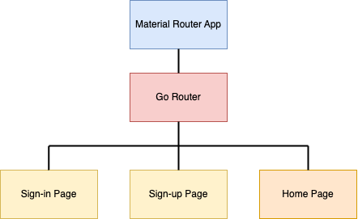

# Flutter Firebase Authentication with Riverpod 2.5 and GoRouter


Due to its numerous features and seamless integration, many developers are choosing Firebase for authentication in their Flutter apps. At the same time, Riverpod is gaining popularity as a state-management solution. Naturally, many are curious about how Riverpod can be used to set up Firebase authentication.

In this guide, we’ll explore how to implement Firebase authentication using Riverpod's code generation. Additionally, we’ll cover how to set up an authentication guard with GoRouter, and manage loading states while the user is logging in.

## What we are going to build

This tutorial assumes that you have already connected your firebase project with your flutter app. If you haven’t done that checkout the official guide from the firebase team.
https://firebase.google.com/docs/auth/flutter/start


## Folder Structure


## Getting started

Before we can start implementing our authentication flow, we must first install all required dependencies.


#### Dependencies

```
flutter pub add firebase_auth
flutter pub add flutter_riverpod
flutter pub firebase_core
flutter pub riverpod_annotation
```

#### Developement Dependencies

```
flutter pub riverpod_generator --dev
flutter pub riverpod_lint --dev
flutter pub build_runner --dev
```


After installing all the required packages, we need to initialize Firebase Authentication in our app. We do this by adding the following lines at the start of our main function. Optionally, you might also want to connect your app to the Firebase emulator in debug mode.

```
//main.dart

WidgetsFlutterBinding.ensureInitialized();
await Firebase.initializeApp(options: DefaultFirebaseOptions.currentPlatform);


// optional
if (kDebugMode) {
    await FirebaseAuth.instance.useAuthEmulator('localhost', 9099);
}
```

## Riverpod

To enable Riverpod for our app we need to add a Provider Scope at the top of the widget tree. Provider Scope is a widget from the Riverpod package and stores the state of providers and allows overriding the behavior of a specific provider. Your main function should look something like this:

```
// main.dart

void main() async {
    WidgetsFlutterBinding.ensureInitialized();
    await Firebase.initializeApp(options: DefaultFirebaseOptions.currentPlatform);

    if (!kDebugMode) {
        await FirebaseAuth.instance.useAuthEmulator('localhost', 9099);
    }

    // * your other configuration *

    runApp(
        const ProviderScope(
            child: MyApp(),
        ),
    );
}
```

### About Code Generation

Since version 2.5, Riverpod supports code generation as its prefered way of creating providers. Code generation has serveral advantages over regular providers: improved Syntax, readability and general developer experience; improved debugging and reduction of boilerplate code. Additionally, Stateful hot-reload is supported.

The major drawback of code generation is its dependence on the build_runner. The build_runner is a tool used by flutter to generate code and must be run as a CLI command in the background.

The good news is that once static setaprogramming is supported Riverpod will migrate to metaprogramming and build_runner will no longer be required. From there on Riverpod will exclusively support the code generation syntax. Therefore, we will be using code generation is this example, as it’s the futureproof way of using Riverpod.

For more details on code generation and migration from regular provider, checkout the official Riverpod documentation. https://riverpod.dev/docs/concepts/about_code_generation

### Generating an example provider

_This section is not required for the rest of the guide and is only designed for total beginners to Riverpod code generation._

Let’s try to understand how code generation works by creating an example. We will create the example in the example_provider.dart file.

```
// example_provder.dart

// 1. import the riverpod_annotation.dart
import 'package:riverpod_annotation/riverpod_annotation.dart';

// 2. add the part file to mark for code generation
part 'example_provider.g.dart';

// 3. add the @riverpod annotation and create your provider function
@riverpod
String example(ExampleRef ref) {
    return 'This an example provider';
}
```

In the first step, we need to import the riverpod_annotation package we have installed so we can use the code generation. Then we will need to add the **part** keyword followed by the current file name, .g and .dart. This will tell the builder_runner that the file requires code generation, and in which file the generated code must be stored.

Next, we’ll use the @riverpod annotation followed by a function to create the provider. For every provider this function requires the ref parameter. The type of ref must be the name of the provider, starting with a capital letter followed by Ref. Notice that, when we first create the function, the type of the ref parameter will be undefined. To fix this we need to start the build runner. So, let’s do that by running:

```
dart run build_runner watch
```

The watch argument ensures that build_runner listens for changes and automatically regenerates code when necessary.

Once build_runner starts, the example_provider.g.dart file will be generated, resolving the linting error for the ref parameter. The provider will now be created with the name **exampleProvider**. You can then use any ref to access the provider's value like this:

```
final example = ref.watch(exampleProvider);
```

## Project Structure




## Authentication

To implement Firebase Authentication, we will start by creating the Authentication Repository. This class will manage all API calls to Firebase via the Firebase Auth SDK and serve as our single point of contact with the Firebase Authentication server and SDK. This approach will make it easier to mock and test the authentication flow. Additionally, if we later decide to replace Firebase Authentication with another system, we will only need to override this repository.

```
//firebase_auth_repository.dart

class FirebaseAuthenticationRepository
{
AuthenticationRepository(this.firebaseAuth);

final FirebaseAuth _firebaseAuth;
    // .. add other functions here
}
```

After cerating the repository, we need to share it across the app. We do this by creating our first riverpod providers. We use the firebase auth provider to inject the instance of the firebase auth SDK into our auth repository. Note that both are marked as **keep alive: true**, because they will be required throughout the lifetime of the app.

```
//firebase_auth_repository.dart

@Riverpod(keepAlive: true)
FirebaseAuthenticationRepository authRepository(AuthRepositoryRef ref) {
    final auth = ref.watch(firebaseAuthProvider);
    return FirebaseAuthenticationRepository(auth);
}
@Riverpod(keepAlive: true)
    FirebaseAuth firebaseAuth(FirebaseAuthRef ref) {
    return FirebaseAuth.instance;
}
```

Awesome! Before we start implementing the sign-in functionality, we should take a look at how Firebase Authentication works.
As you can see above, we can access the firebase auth SDK with the FirebaseAuth.instance object. This object allows us to interact with Firebase and stores information about the currently signed-in user. When a user is signed in successfully, the currentUser attribute of the instance updates to reflect the current user. If no user is signed in, this attribute will be null. Let’s add a function to read this value:

```
User? get currentUser => _firebaseAuth.currentUser;
```

Great, we've accessed the currently signed-in user. The problem is that we receive the current user as the User class from the Firebase SDK. As mentioned earlier, we want our repository to serve as the **single point of contact** with the Firebase SDK. Therefore, we should map the User class to a local class that we can share within the app, without directly accessing the Firebase SDK outside of the repository. Let’s call this class AppUser:

```
// app_user_model.dart

class AppUser {
    const AppUser({
        required this.uid,
        this.email,
        this.emailVerified = false,
        this.displayName,
    });

    final String uid;
    final String? email;
    final bool emailVerified;
    final String? displayName;

    // We will use this function to map the Firebase to our AppUser
    static AppUser? fromUser(User? user) {
    if (user == null) {
        return null;
    }
    return AppUser(
        uid: user.uid,
        email: user.email,
        displayName: user.displayName,
        emailVerified: user.emailVerified,
    );
    }
}
```

We can now replace the currentUser function with the following.

```
//firebase_auth_repository.dart inside the repository

AppUser? get currentUser => _convertUser(_firebaseAuth.currentUser);

// converts the nullable FirebaseUser to our AppUser
AppUser? _convertUser(User? user) =>
user == null ? null : AppUser.fromUser(user);
```

Not only does the Firebase SDK allow us to read the current user synchronously, but it also lets us listen to changes in the user state through three different functions: authStateChanges, idTokenChanges, and userChanges. All these functions return a stream that can be used to listen for different user-related change events. In this tutorial, we will focus only on the authStateChanges function, as it pertains to the authentication flow. Let’s add this function to the authentication repository.

```
//firebase_auth_repository.dart inside the repository
Stream<AppUser?> authStateChanges() {
    return _firebaseAuth.authStateChanges().map(_convertUser);
}
```

We should also create a new provider for listening to the auth state changes:

```
//firebase_auth_repository.dart

@Riverpod(keepAlive: true)
Stream<AppUser?> authStateChange(AuthStateChangeRef ref) {
    final auth = ref.watch(authRepositoryProvider);
    return auth.authStateChanges();
}
```

That out of the way, we can finally implement out sign-in, sign-out and sign-up functions.

```
//firebase_auth_repository.dart inside the repository

Future<void> signInWithEmailAndPassword({
    required String email,
    required String password,
}) {
    return _firebaseAuth.signInWithEmailAndPassword(
        email: email,
        password: password,
    );
}

Future<void> createUserWithEmailAndPassword({
    required String email,
    required String password,
}) {
    return _firebaseAuth.createUserWithEmailAndPassword(
        email: email,
        password: password,
    );
}

Future<void> signOut() async {
    return _firebaseAuth.signOut();
}
```

## Handling Loading States

In the last section, we implemented the authentication repository. Now, it’s time to move on to logging in the user. However, the current authentication repository doesn’t handle loading states. Managing loading states is essential because it allows us to display error messages, show users that a process is running in the background, and prevent multiple sign-in attempts before the current process completes.

To solve this, we’ll create a notifier provider that manages the loading state and calls the functions of the authentication repository. In simple terms, a notifier provider is a tool from Riverpod that helps manage and keep track of changes in a piece of data, like whether the app is loading, successful, or has encountered an error. By using a notifier provider, we can better handle these states during the sign-in process and improve the user experience. While this adds a small extra step, it’s definitely worth it.

But first, let’s add a new class to the loading_state.dart file, which will store the loading and error states:

```
// loading_state.dart

class AuthLoadingState {
    const AuthLoadingState(this.state, this.error);

    final LoadingStateEnum state;
    final Exception? error;

    bool get isLoading => state == LoadingStateEnum.loading;

    bool get hasError => state == LoadingStateEnum.error;
}

enum LoadingStateEnum {
    initial,
    loading,
    success,
    error,
}
```

The only thing left to do, before we can implement the UI, is to implement the notifier provider. We will implement it in the auth_controller.dart file. Note, that every time a function is called the state is set to loading and when completed to success or error.

```
// auth_controller.dart

part 'auth_controller.g.dart';

@riverpod
class AuthController extends _$AuthController {

    @override
    AuthLoadingState build() {
        return const AuthLoadingState(LoadingStateEnum.initial, null);
    }

    Future<void> sigInInUserWithEmailAndPassword(
    String email, String password) async {
        state = const AuthLoadingState(LoadingStateEnum.loading, null);
        try {
            final authRepository = ref.watch(authRepositoryProvider);
            await authRepository.signInWithEmailAndPassword(
            email: email, password: password);
            state = const AuthLoadingState(LoadingStateEnum.success, null);
            } on Exception catch (e) {
            state = AuthLoadingState(LoadingStateEnum.error, e);
        }
    }

    Future<void> createUserWithEmailAndPassword(
    String email, String password) async {
        state = const AuthLoadingState(LoadingStateEnum.loading, null);
        try {
            final authRepository = ref.watch(authRepositoryProvider);
            await authRepository.createUserWithEmailAndPassword(
            email: email, password: password);
        state = const AuthLoadingState(LoadingStateEnum.success, null);
        } on Exception catch (e) {
            state = AuthLoadingState(LoadingStateEnum.error, e);
        }
    }
    Future<void> signOut() async {
        state = const AuthLoadingState(LoadingStateEnum.loading, null);

        final authRepository = ref.watch(authRepositoryProvider);
        try {
            await authRepository.signOut();
            state = const AuthLoadingState(LoadingStateEnum.success, null);
        } on Exception catch (e) {
            state = AuthLoadingState(LoadingStateEnum.error, e);
        }
    }
}
```

## User Interface

Whit the authentication controller completed we can now finally implement the user interface. Let’s start with the home page, as it is simple and requires no additional logic, compared to sign-in and sign-up pages.

```
// home_page.dart

class AppHomePage extends ConsumerWidget {
    const AppHomePage({super.key});

    @override
    Widget build(BuildContext context, WidgetRef ref) {
        return Scaffold(
            appBar: AppBar(
                title: const Text('App Home Page'),
            ),
            body: Padding(
                padding: const EdgeInsets.all(16.0),
                child: Center(
                    child: Column(
                    children: [
                        const Text('Welcome to the App Home Page'),
                        ElevatedButton(
                            onPressed: () async {
                            await ref.read(authControllerProvider.notifier).signOut();
                            },
                            child: const Text('Sign Out'),
                            ),
                        ],
                    ),
                ),
            ),
        );
    }
}
```

Ok now let’s add the sigin page

```
// signin_page.dart

class SignInPage extends ConsumerStatefulWidget {
    const SignInPage({super.key});

    @override
    ConsumerState<SignInPage> createState() => _SignInPageState();
    }

    class _SignInPageState extends ConsumerState<SignInPage> {
    final TextEditingController _emailController = TextEditingController();
    final TextEditingController _passwordController = TextEditingController();

    Future<void> _signIn() async {
    final auth = ref.read(authControllerProvider.notifier);

        await auth.sigInInUserWithEmailAndPassword(
        _emailController.text.trim(),
        _passwordController.text.trim(),
        );
    }

    @override
    Widget build(BuildContext context) {
    return Scaffold(
      appBar: AppBar(
        title: const Text('Sign In Page'),
      ),
      body: Padding(
        padding: const EdgeInsets.all(16.0),
        child: Column(
          children: [
            const Text(
              'Welcome Back',
              style: TextStyle(fontSize: 24),
            ),
            const Text('Sign in to your account'),
            const SizedBox(
              height: 5,
            ),
            TextField(
              controller: _emailController,
              decoration: const InputDecoration(
                border: OutlineInputBorder(),
                labelText: 'Email',
              ),
            ),
            const SizedBox(
              height: 20,
            ),
            TextField(
              controller: _passwordController,
              decoration: const InputDecoration(
                border: OutlineInputBorder(),
                labelText: 'Password',
              ),
              obscureText: true,
            ),
            const SizedBox(
              height: 20,
            ),
            SizedBox(
              width: MediaQuery.sizeOf(context).width * 0.5,
              child: ElevatedButton(
                onPressed: _signIn,
                child: const Text('Sign In'),
              ),
            ),
            const SizedBox(
              height: 20,
            ),
            Row(
              mainAxisAlignment: MainAxisAlignment.center,
              children: [
                const Text('Don\'t have an account?'),
                const SizedBox(
                  width: 10,
                ),
                TextButton(
                  onPressed: () {
                    context.goNamed(AppRoutes.signUp.routeName);
                  },
                  child: const Text('Sign Up'),
                ),
              ],
            ),
          ],
        ),
      ),
    );
  }
}
```

There are several ways to display a loading indicator, but I prefer using the Riverpod function ref.listen. This function is similar to ref.watch, with the key difference being that ref.watch returns the current value of the provider, while ref.listen provides access to a callback that gives you both the previous and current values of the provider.

We’ll use ref.listen to display a progress indicator when the state of the authentication controller is loading, and hide it once the state changes to success or error. If the state encounters an error, we’ll also show an error snackbar. Let’s add this logic at the start of the build function.

Additionally, we need a variable to store the context of the loading indicator, so we'll add _progressIndicatorContext to the widget’s state.


```
// signin_page.dart

// loading indicator context inside _SignInPageState
BuildContext? _progressIndicatorContext;

// add dispose methode to the state of the widget
@override
void dispose() {
    // dispose controllers
    _emailController.dispose();
    _passwordController.dispose();

    // close loading dialog when closing page
    if (_progressIndicatorContext != null &&
        _progressIndicatorContext!.mounted) {
    Navigator.of(_progressIndicatorContext!).pop();
    _progressIndicatorContext = null;

    }
    super.dispose();
}

```

```
// signin_page.dart build function

Widget build(BuildContext context) {
    ref.listen(authControllerProvider, (prev, state) async {
      if (state.isLoading) {
        await showDialog(
          context: context,
          builder: (ctx) {
            _progressIndicatorContext = ctx;
            return const Center(
              child: CircularProgressIndicator(),
            );
          },
        );
        return;
      }

      // close circular progress indicator after rebuild to guarantee that the
      // context is still valid
      WidgetsBinding.instance.addPostFrameCallback((timeStamp) {
        if (_progressIndicatorContext != null &&
            _progressIndicatorContext!.mounted) {
          Navigator.of(_progressIndicatorContext!).pop();
          _progressIndicatorContext = null;
        }
      });

      if (state.hasError) {
        ScaffoldMessenger.of(context).showSnackBar(
          SnackBar(
            behavior: SnackBarBehavior.floating,
            content: Text('Error: ${state.error}'),
          ),
        );
      }
    });
    // rest of the build function
    ...
}
```

When analyzing this code, we notice two things. First, the circulator progress indicator is shown as a dialog. This dialog creates a new context, which we store in the widget's state so we can close it later. Second when closing the dialog, we are using the **addPostFrameCallback** to ensure that the dialog is only closed after the widget has been rebuild and the context is mounted. This is required because the value change of the provider might trigger a rebuild of the widget.

I have chosen not to show the sign-up page code here, as it is nearly identical to the sign-in page. However, you can find the code, as well as the rest of the project, in the GitHub repository linked at the end of the post.

## Routing Setup

In this section, we will set up the routing in our app and create an authentication guard. An authentication guard is a mechanism which redirects unauthenticated users to the sign-in page and blocks them from seeing content they are not allowed not see. We achieve this by listening to the currently signed-in user from the **authStateChanges** stream we have implemented in our repository.

Here we will use the Go Router package that we installed at the start of the tutorial. To enable Go Router for our app, we first need to create an instance of the GoRouter class and configure each route of the app. Before we do that, we should define an enum in the app_route_enum.dart file to store all our routes. Additionally, we can add an extension to the enum to define the path and name of each route.

```
// app_route_enum.dart

enum AppRoutes {
    home,
    signIn,
    signUp,
}

extension AppRoutesExtension on AppRoutes {
    String get path {
    switch (this) {
        case AppRoutes.home:
    return '/';
        case AppRoutes.signIn:
    return '/signin';
        case AppRoutes.signUp:
    return '/signup';
    }
}

String get routeName {
    switch (this) {
        case AppRoutes.home:
            return 'Home';
        case AppRoutes.signIn:
            return 'SignIn';
        case AppRoutes.signUp:
            return 'SignUp';
        }
    }
}
```

That done, we can create the Go Router. Since we want to access the authentication state of the user, we create a new provider inside the app_router.dart file. And define our routes and set the initial location.

```
// app_router.dart

part 'app_router.g.dart';

final _key = GlobalKey<NavigatorState>();

@riverpod
GoRouter router(RouterRef ref) {
    // accessing the auth repository
    final auth = ref.watch(authRepositoryProvider);
    return GoRouter(
        navigatorKey: _key,
        initialLocation: AppRoutes.home.path,
        routes: [
        GoRoute(
            path: AppRoutes.home.path,
            name: AppRoutes.home.routeName,
            pageBuilder: (context, state) => const MaterialPage(
                child: AppHomePage(),
            ),
        ),
        GoRoute(
            path: AppRoutes.signIn.path,
            name: AppRoutes.signIn.routeName,
            pageBuilder: (context, state) => const MaterialPage(
                child: SignInPage(),
            ),
        ),
        GoRoute(
            path: AppRoutes.signUp.path,
            name: AppRoutes.signUp.routeName,
            pageBuilder: (context, state) => const MaterialPage(
                child: SignUpPage(),
            ),
        ),
        // * your other routes *
        ],
    );
}
```

Before we configure GoRouter, we first need to enable routing for our app. In this case, we’ll use MaterialApp, but we need to change it to MaterialApp.router to integrate routing. The MaterialApp.router requires the routerConfig parameter, which will be set to the value of our routerProvider.

```
// app.dart

class MyApp extends ConsumerWidget {
  const MyApp({super.key});

  @override
  Widget build(BuildContext context, WidgetRef ref) {
    final GoRouter router = ref.watch(routerProvider);

    return MaterialApp.router(
      routerConfig: router,
      title: 'Riverpod Authenticated Demo',
    );
  }
}
```

As mentioned above, we need to listen to the current authenticated user. However Go Router is incapable of listening to streams directly. So, we must first convert the stream to a listenable. To do that we create a new class, inside the refresh **listenable.dart** file, which maps the stream to a listenable.

```
// refresh_listenable.dart

class GoRouterRefreshStream extends ChangeNotifier {
    GoRouterRefreshStream(Stream<dynamic> stream) {
        notifyListeners();
        _subscription = stream.asBroadcastStream().listen(
            (dynamic *) => notifyListeners(),
        );
    }

    late final StreamSubscription<dynamic> _subscription;

    @override
    void dispose() {
        _subscription.cancel();
        super.dispose();
    }
}
```

[Source:
https://stackoverflow.com/a/71532680/13971557]

We start listening to the authentication changes by setting the refreshListenable parameter of the Go Router.

```
// app_router.dart

return GoRouter(
    // already defined parameters
    routes: [...],
    refreshListenable: GoRouterRefreshStream(auth.authStateChanges()),
);
```

Every time the refresh Listenable updates, the router reevaluates its current state and checks if it should redirect. Currently the redirect function is not implemented, so the page will remain unchanged. Therefore, we need add the redirect function.

```
// app_router.dart

return GoRouter(
    // already defined parameters
    routes: [...],
    refreshListenable: GoRouterRefreshStream(auth.authStateChanges()),
    redirect: (context, state) async {
        final bool isLoggedIn = auth.currentUser != null;
        final bool isLoggingIn = state.matchedLocation == AppRoutes.signIn.path ||
        state.matchedLocation == AppRoutes.signUp.path;

        // should redirect the user to the sign in page if they are not logged in
        if (!isLoggedIn && !isLoggingIn) {
            return AppRoutes.signIn.path;
        }

        // should redirect the user after they have logged in
        if (isLoggedIn && isLoggingIn) {
            return AppRoutes.home.path;
        }
        // do not redirect
        return null;
    },
);
```
If we now, try to sign in we will be redirected to the home page.


Thank you for reading my first article! I hope you found it helpful. If you think there are ways to improve this implementation, feel free to leave a comment. For access to the full source code, check out the link here 👇 👇: 
https://github.com/JakobProssinger/FirebaseRiverpodGoRouterExample
